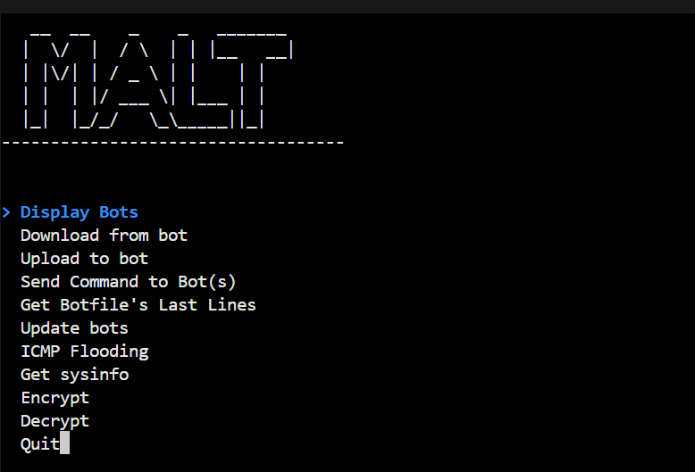
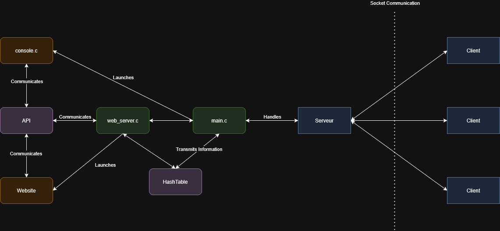

# MALT botnet
This school project is a client/server application written in C for managing a network of simulated bots. It includes a server, connected clients, a web interface and several communication, command and file transfer functions.
>**:warning: For educationnal proposes only, use at you own risk :warning:**
>
---
## Table of contents
- [MALT botnet](#malt-botnet)
- [⚙️ Main Functions](#️-main-functions)
- [🔧 Compilation](#-compilation)
- [🚀 Execution](#-execution)
- [🧰 Usage](#usage)
- [📡 API Routes](#api-routes)
- [📦 Librairies](#librairies)


---

## Overview of the project 




## ⚙️ Main Functions

**Server**
- Manages the connection of multiple clients
- Web interface with Mongoose to monitor activity
- Server command line interface for direct interaction
- File exchange (upload/download)
- Activity logging (`main.log`)
     **Web_Server**
    - HTML/CSS/JS user interface
    - View connected bots
    - Control and send commands


**Client**
- Listens to and executes commands sent by the server
- File transfer
- Handles client errors
- Locally stored messages


---


## 🔧 Compilation

The project uses **CMake** to compile :

In order to compile, you will need to have installed the following librairies installed on your machine:
```bash
apt-get update && apt-get install -y cmake clang libcunit1-dev libcunit1-doc libcmocka-dev libncurses5-dev libncursesw5-dev curl libcurl4-openssl-dev

```

```bash
mkdir build
cd build
cmake -S .. -B .
cmake --build .
```

---
## 🚀 Execution

The project currently uses dynamic linking for external libraries. This means that some libraries need to be installed on the system prior to starting the server / client.

```bash
- apt-get update && apt-get install -y libcmocka-dev
- export LD_LIBRARY_PATH=/usr/lib:/usr/local/lib:/lib/x86_64-linux-gnu/:$LD_LIBRARY_PATH
- ldconfig
```
#### Running the Server
```bash
./build/server
```
#### Running the Client
```bash
./build/client -a <server_ip> -p <port>
```

See command line arguments below for more information.

---
## Usage

```bash
Usage: program [OPTIONS]
Options:
  -h, --help               Show this help message and exit.
  -vv, --debug             Enable debug logs (show all debug logs and above).
  -v, --info               Enable info logs (show all info logs and above).
  -e, --error              Enable error logs (only show errors, default).
  -se, --suppress-errors   Suppress error logs (no errors in console or file).
  -a, --addr <IP>          Specify the server IP address (client only).
  -p, --port <PORT>        Specify the server port (client only).
  -c, --cli                Enable CLI mode (server only).
```
## API Routes

| Route             | Method | Description                                                                |
|-------------------|--------|----------------------------------------------------------------------------|
| `/api/bots`       | GET    | Returns the list of connected bots.                                        |
| `/api/download`   | POST   | Initiates a file download from a specified bot.                            |
| `/api/upload`     | POST   | Uploads a file to a specified bot.                                         |
| `/api/command`    | POST   | Sends a command to a specified bot.                                        |
| `/api/flood`      | POST   | Handles ICMP ping floods.                                                  |
| `/api/encrypt`    | POST   | Handles encryption of machines.                                            |
| `/api/decrypt`    | POST   | Handles decryption of machines.                                            |
| `/api/status`     | GET    | Returns the current status of the server (e.g., number of connected bots). |
| `/api/botfile`    | POST   | Retrieves a specific file from a bot.                                      |
| `/api/cwd`        | POST   | Gets the current working directory of a bot.                               |
| `/api/update`     | POST   | Updates bot information (e.g., after executing a command).                 |
| `/api/sysinfo`    | POST   | Sends a sysinfo request to clients.                                        |
| `/static/*`       | GET    | Serves static files (HTML, CSS, JS) for the web interface.                 |

## Librairies

cURL (call one l'API for command line interface),
cJSON (webserver & console use it for data transmission),
cMocka (tests),
ncurses (to beautify the command line interface),
mongoose (for the webserver)